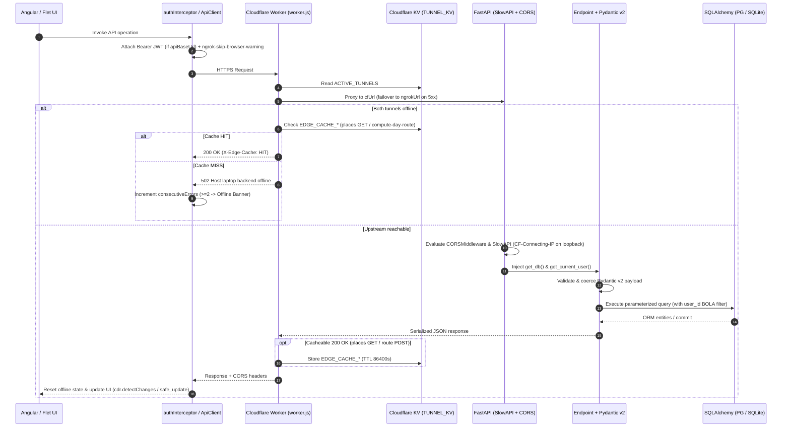

# API Request Lifecycle Diagram

End-to-end request lifecycle through the Cloudflare Worker edge proxy, FastAPI middleware, BOLA ownership checks, and SQLAlchemy persistence.

```mermaid
sequenceDiagram
    autonumber
    participant UI as Angular / Flet UI
    participant HTTP as authInterceptor / ApiClient
    participant Worker as Cloudflare Worker (worker.js)
    participant KV as Cloudflare KV (TUNNEL_KV)
    participant FastAPI as FastAPI (SlowAPI + CORS)
    participant Route as Endpoint + Pydantic v2
    participant DB as SQLAlchemy (PG / SQLite)

    UI->>HTTP: Invoke API operation
    HTTP->>HTTP: Attach Bearer JWT (if apiBaseUrl) + ngrok-skip-browser-warning
    HTTP->>Worker: HTTPS Request
    Worker->>KV: Read ACTIVE_TUNNELS
    Worker->>FastAPI: Proxy to cfUrl (failover to ngrokUrl on 5xx)
    alt Both tunnels offline
        Worker->>KV: Check EDGE_CACHE_* (places GET / compute-day-route)
        alt Cache HIT
            Worker-->>HTTP: 200 OK (X-Edge-Cache: HIT)
        else Cache MISS
            Worker-->>HTTP: 502 Host laptop backend offline
            HTTP->>HTTP: Increment consecutiveErrors (>=2 -> Offline Banner)
        end
    else Upstream reachable
        FastAPI->>FastAPI: Evaluate CORSMiddleware & SlowAPI (CF-Connecting-IP on loopback)
        FastAPI->>Route: Inject get_db() & get_current_user()
        Route->>Route: Validate & coerce Pydantic v2 payload
        Route->>DB: Execute parameterized query (with user_id BOLA filter)
        DB-->>Route: ORM entities / commit
        Route-->>Worker: Serialized JSON response
        opt Cacheable 200 OK (places GET / route POST)
            Worker->>KV: Store EDGE_CACHE_* (TTL 86400s)
        end
        Worker-->>HTTP: Response + CORS headers
        HTTP-->>UI: Reset offline state & update UI (cdr.detectChanges / safe_update)
    end
```
