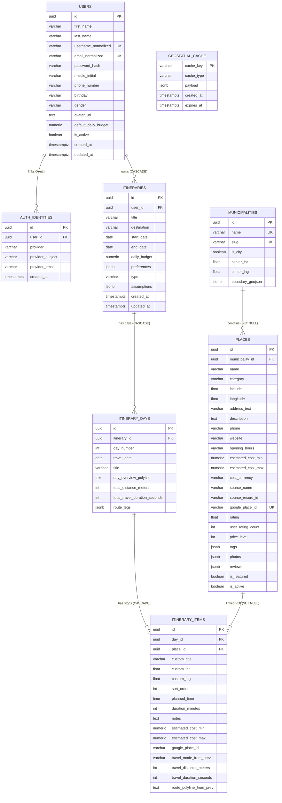

# Database Entity Relationship Diagram (ERD)

Verified 8-table schema from `backend/app/models/entities.py` and Alembic migrations `0001`–`0004`.

```mermaid
erDiagram
    USERS ||--o{ AUTH_IDENTITIES : "links OAuth"
    USERS ||--o{ ITINERARIES : "owns (CASCADE)"
    MUNICIPALITIES ||--o{ PLACES : "contains (SET NULL)"
    ITINERARIES ||--o{ ITINERARY_DAYS : "has days (CASCADE)"
    ITINERARY_DAYS ||--o{ ITINERARY_ITEMS : "has stops (CASCADE)"
    PLACES ||--o{ ITINERARY_ITEMS : "linked POI (SET NULL)"

    USERS {
        uuid id PK
        varchar first_name
        varchar last_name
        varchar username_normalized UK
        varchar email_normalized UK
        varchar password_hash
        varchar middle_initial
        varchar phone_number
        varchar birthday
        varchar gender
        text avatar_url
        numeric default_daily_budget
        boolean is_active
        timestamptz created_at
        timestamptz updated_at
    }

    AUTH_IDENTITIES {
        uuid id PK
        uuid user_id FK
        varchar provider
        varchar provider_subject
        varchar provider_email
        timestamptz created_at
    }

    MUNICIPALITIES {
        uuid id PK
        varchar name UK
        varchar slug UK
        boolean is_city
        float center_lat
        float center_lng
        jsonb boundary_geojson
    }

    PLACES {
        uuid id PK
        uuid municipality_id FK
        varchar name
        varchar category
        float latitude
        float longitude
        varchar address_text
        text description
        varchar phone
        varchar website
        varchar opening_hours
        numeric estimated_cost_min
        numeric estimated_cost_max
        varchar cost_currency
        varchar source_name
        varchar source_record_id
        varchar google_place_id UK
        float rating
        int user_rating_count
        int price_level
        jsonb tags
        jsonb photos
        jsonb reviews
        boolean is_featured
        boolean is_active
    }

    ITINERARIES {
        uuid id PK
        uuid user_id FK
        varchar title
        varchar destination
        date start_date
        date end_date
        numeric daily_budget
        jsonb preferences
        varchar type
        jsonb assumptions
        timestamptz created_at
        timestamptz updated_at
    }

    ITINERARY_DAYS {
        uuid id PK
        uuid itinerary_id FK
        int day_number
        date travel_date
        varchar title
        text day_overview_polyline
        int total_distance_meters
        int total_travel_duration_seconds
        jsonb route_legs
    }

    ITINERARY_ITEMS {
        uuid id PK
        uuid day_id FK
        uuid place_id FK
        varchar custom_title
        float custom_lat
        float custom_lng
        int sort_order
        time planned_time
        int duration_minutes
        text notes
        numeric estimated_cost_min
        numeric estimated_cost_max
        varchar google_place_id
        varchar travel_mode_from_prev
        int travel_distance_meters
        int travel_duration_seconds
        text route_polyline_from_prev
    }

    GEOSPATIAL_CACHE {
        varchar cache_key PK
        varchar cache_type
        jsonb payload
        timestamptz created_at
        timestamptz expires_at
    }
```
